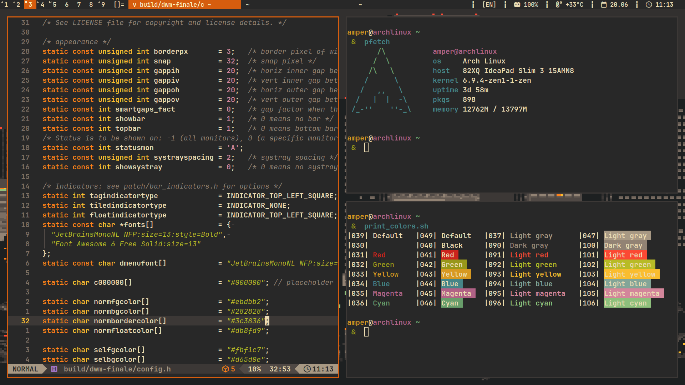

# Gruvbox themed dwm



This is my dwm configuration files. Here you'll find:
- dwm
- dwmblocks
- alacritty
- fish
- starship

## Installation
```bash
git clone https://github.com/Andrey0189/dwm-gruvbox
cd dwm-gruvbox
cd dwm
make && sudo make install
cd ../dwmblocks
# Change your location in blocks.h for the weather widget
make && sudo make install
cd ..
# This will overwrite your previous configuration
cp -r .config/ ~/
cp startdwm.sh /usr/local/bin/
```

If you use a display manager
```bash
sudo cp dwm.desktop /usr/local/share/xsessions/
```
If you don't
```bash
echo "exec /usr/local/bin/startdwm.sh" >> ~/.xinitrc
```

